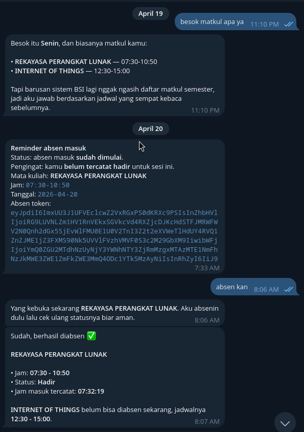

# openstudent-claw

This repository contains the BSI Student automation logic and is designed to run as a managed skill within the OpenClaw framework.

## Preview

<p align="center">
  
</p>

## Quick Start (Docker)

The project uses Docker to provide a consistent environment with OpenClaw and Bun pre-installed.

### 1. Configure Environment

Create or update your Turso database credentials in a `.env` file (or pass them directly to compose):

```bash
TURSO_URL=libsql://your-db.turso.io
TURSO_TOKEN=your-token
```

### 2. Start the Gateway

Launch the OpenClaw gateway using Docker Compose. The repository is mounted as a volume, and the `bsi_students` skill is automatically mirrored into the OpenClaw workspace at startup.

```bash
docker compose up -d
```

**Note:** If you modify the startup script in `docker/openclaw-entrypoint.sh`, you must rebuild the image to apply changes:

```bash
docker compose up -d --build --force-recreate openclaw
```

### 3. Authenticate with OpenAI Codex

This setup uses OpenAI Codex for model operations. Authenticate using the OAuth flow:

```bash
docker exec -it openstudent-claw-openclaw openclaw models auth login --provider openai-codex
```

Follow the interactive prompts to complete the browser-based authentication.

If `openclaw models status` still shows a different default model (like Anthropic), set Codex as the default:

```bash
docker exec -it openstudent-claw-openclaw openclaw models set openai-codex/gpt-5.4
```

### 4. Verify Setup

Check the status of your models and skills:

```bash
# Check model connectivity
docker exec -it openstudent-claw-openclaw openclaw models status

# List available skills (verify 'bsi_students' is present)
docker exec -it openstudent-claw-openclaw openclaw skills list
```

## Repository Structure

- `src/lib/`: Core logic for BSI integration, parsing, and database access.
- `src/scripts/students/`: CLI entry points for student-specific tasks (login, schedule, etc.).
- `SKILL.md`: Definition for the `bsi_students` OpenClaw skill.
- `.agents/skills/`: Additional specialized skills available to the agent.
- `docker/`: Container configuration and entrypoint logic.

## Skill Integration

At container startup, the entrypoint script mirrors the repository into the OpenClaw workspace at `/home/node/.openclaw/workspace/skills/bsi_students`. It automatically runs `bun install` within that mirrored directory to ensure all dependencies are ready for use by the agent.

## Telegram Bot Setup

To use the Telegram channel, add it via the OpenClaw CLI. This stores the configuration in the persistent OpenClaw volume:

```bash
docker compose run --rm openclaw openclaw channels add --channel telegram --token "<TELEGRAM_BOT_TOKEN>"
```

### 2. Pair with the Bot

After adding the channel, message your bot on Telegram. OpenClaw will generate a pairing code and wait for approval. To approve the connection, run:

```bash
docker exec -it openstudent-claw-openclaw openclaw pairing approve telegram <PAIRING_CODE>
```

Example: `docker exec -it openstudent-claw-openclaw openclaw pairing approve telegram xxxx`

### 3. Verify Telegram Setup

After adding and pairing the channel, verify that it's correctly configured and active:

```bash
# List all channels to see the Telegram entry
docker exec -it openstudent-claw-openclaw openclaw channels list

# Check the status of the Telegram channel
docker exec -it openstudent-claw-openclaw openclaw channels status --channel telegram --probe

# View logs to ensure there are no connection errors
docker exec -it openstudent-claw-openclaw openclaw channels logs --channel telegram
```

## Reminder Poll Operator Contract

`bun src/scripts/reminder/reminder-poll.ts` is a one-shot CLI. It checks one account, evaluates today's active classes, prints one JSON result to stdout, then exits. It is meant to be invoked by an external scheduler every minute, not kept running as an internal daemon.

Full reminder-cron operational documentation lives in:

- [`docs/reminder-cron.md`](./docs/reminder-cron.md)

### Required environment

The reminder poll is single-account and Telegram-only.

- `BSI_USERNAME` is required. The poll resolves exactly one account from this username, and the dedupe key depends on that account id.
- `TELEGRAM_BOT_TOKEN` is required for real sends.
- `TELEGRAM_CHAT_ID` is required for real sends.
- Session access must come from one of these sources:
  - `BSI_XSRF_TOKEN` and `BSI_SESSION_TOKEN`, or
  - an existing stored session for the same `BSI_USERNAME` account in the database.

If you rely on the stored account and session path, the database connection env from the rest of this README must already be set and the account plus session rows must already exist.

### One-shot invocation

Run a single polling cycle with:

```bash
bun src/scripts/reminder/reminder-poll.ts
```

For OS-level Bun cron registration, listing, removal, worker behavior, and scheduler-specific environment, see [`docs/reminder-cron.md`](./docs/reminder-cron.md).

### Polling rules

- Single-account scope only. The poller reads one username from `BSI_USERNAME` and does not fan out across multiple accounts.
- Telegram-only scope only. There is no other delivery channel in this CLI.
- Start-only behavior. A reminder is eligible only after the class has started.
- No end-of-class or repeated reminder stages. If the class is already finished, the item is skipped.
- Already attended items are skipped.

The per-class skip reasons in JSON reflect those checks, including `class_not_started`, `class_finished`, `already_attended`, and `already_reminded`.

### Dedupe behavior

The dedupe contract is one reminder per `(accountId, courseNameSnapshot, courseTimeSnapshot, attendanceDateLocal)` after a delivery is marked `sent`.

That means a later poll on the same local attendance date skips the item with `already_reminded` once the earlier send has been recorded as sent.

### Failure behavior

Fatal operator errors return `ok: false` and exit non-zero. This includes missing `BSI_USERNAME`, a missing account row for that username, missing session access, invalid Telegram config, or a fatal failure while fetching today's active schedule.

Per-item failures do not abort the whole polling cycle. The run can still return `ok: true` with item entries marked `failed` in `items[]`, for example when a status check fails, Telegram send fails for one class, or reminder-delivery store updates fail for one class.

Operators should treat stdout JSON as the primary contract. The top-level `ok` and `counts` fields tell you whether the run failed fatally or completed with mixed item results.
